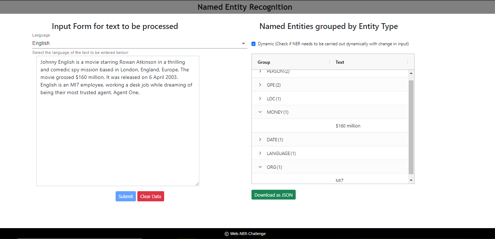

# Web-based named entity recognition

### Background

[Named entity recognition](https://en.wikipedia.org/wiki/Named-entity_recognition) (NER) is a very important and long-standing goal of the NLP community. In it, we attempt to identify and categorize "entities" from text so that we can use them for downstream processing such as argument attachment or [event extraction](http://ceur-ws.org/Vol-779/derive2011_submission_1.pdf). A web application for NER has been built using a python-flask backend and react-frontend. The same has been explained in detail below with a sample sreenshot of the appliication in the end.

## Task: Build a web application that can take in text and return named entities.

```
Text: The pilot, John Doe, flew over the United States in his airplane.

Named entities: John Doe (PERSON), the United States (GPE)
```

### Specifications:
* Text will be no longer than 500 words.
* Spacy is used or recognising entities from the text. Required named entity types are PERSON, GPE (Geopolitical Entity), LOC (Location), ORG (Organization) etc. All entity types are listed here: 
PERSON:      People, including fictional.
NORP:        Nationalities or religious or political groups.
FAC:         Buildings, airports, highways, bridges, etc.
ORG:         Companies, agencies, institutions, etc.
GPE:         Countries, cities, states.
LOC:         Non-GPE locations, mountain ranges, bodies of water.
PRODUCT:     Objects, vehicles, foods, etc. (Not services.)
EVENT:       Named hurricanes, battles, wars, sports events, etc.
WORK_OF_ART: Titles of books, songs, etc.
LAW:         Named documents made into laws.
LANGUAGE:    Any named language.
DATE:        Absolute or relative dates or periods.
TIME:        Times smaller than a day.
PERCENT:     Percentage, including ”%“.
MONEY:       Monetary values, including unit.
QUANTITY:    Measurements, as of weight or distance.
ORDINAL:     “first”, “second”, etc.
CARDINAL:    Numerals that do not fall under another type.
* Each identified entity is grouped under its corresponding entity label on the righthand side. The AG Grid module is used for creating the interactive table.
* If no named entities are found, "No rows found" message is returned in the table.
* The user has the option to choose from 3 languages - English, French and Spanish. 
* The user has the option to view/recognise the named entities dynamically as the text is entered in the input text area. This option can be checked off to view the result only upon clicking the Submit button. 
* Clear Data clears/erases the data from both the input text area and output table.
* The user also has the option to download the list of recognised entities as a JSON file.

### Instructions to Execute:
The provided templates have been used for creating the frontend in react and backend using flask.
1. Make sure to have `Node.js`, `npm` and Python (preferably 3.6+) installed.
   * In case you don't have Node.js or npm installed, refer to the NodeSource blog posts [Installing Node.js Tutorial: Using nvm](https://nodesource.com/blog/installing-node-js-tutorial-using-nvm-on-mac-os-x-and-ubuntu/) (macOS and Ubuntu) or [Installing Node.js Tutorial: Windows](https://nodesource.com/blog/installing-nodejs-tutorial-windows/) (Windows) for instructions.
2. Make sure to have "make" installed. The MakeFile as been configured to run the application by simply executing the commands in the following two steps.
3. Run `make install FRONTEND=react-frontend BACKEND=flask-backend` to setup the backend and frontend environments
4. Run `make start` to run the application.
5. Use `npm run format` to beautify the react code if required. Lint for react is also implemented while compiling the app.

NOTE: The application has been configured for a production-build. The same can be run only by creating a docker image in a linux environment using a Dockerfile similar to the one attached. The conf file for the nginx production server has also been attached.



> If you have any questions/comments while working on this, please reach out to me at vijeyshr@usc.edu.
